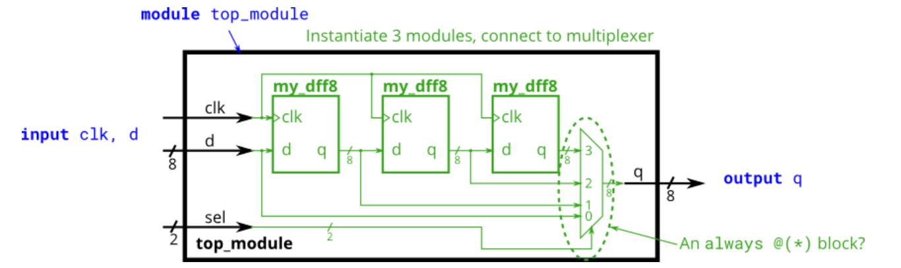

# SystemVerilog学习报告
2026/1/23 updated by LCJ
第一周学习平台：HDLBits


---

## 第一部分 入门 SV 核心基础语法


### SV 的基本单元：模块（Module）
模块是 SV 中描述硬件的最小独立单元，所有逻辑设计都必须写在模块内，类比编程中的 “函数 / 类”，但模块描述的是硬件电路的结构和行为。

``` Verilog
// 模块定义格式：module 模块名(端口列表); 
//              逻辑描述; 
//              endmodule

module basic_module(
    // 端口声明：方向(input/output/inout) + 数据类型 + 端口名
    input  logic clk,       // 输入时钟
    input  logic rst,       // 输入复位
    input  logic [3:0] in,  // 4位宽输入（位宽[高位:低位]）
    output logic [3:0] out  // 4位宽输出
);

// ------------ 核心逻辑描述区 ------------
// 这里写组合逻辑/时序逻辑代码

endmodule
```
---

### 连续赋值（assign）：组合逻辑专属
- **语法：** `assign 目标信号 = 表达式;`
- **特点：** “实时赋值”，只要右边表达式的任意信号变化，左边立更新
- **适用：** 简单组合逻辑（门电路、多路选择器、加法器）
- **赋值符：只能用阻塞赋值=**
示例：assign 实现与非门

``` verilog
module nand_gate(
    input  logic a, b,
    output logic out
);
    // 使用连续赋值：out = a NAND b
    assign out = ~(a & b);
endmodule
```
**注意赋值语句结尾的分号！**

#### 🔹位拼接写法
- **语法：** `{信号1, 信号2, ..., 信号N}`
位拼接的作用是把多个信号的比特位按顺序 “打包” 成一个宽位信号，或者反过来把一个宽位信号 “拆包” 成多个窄位信号。
- 应用在`assign`语句中示例如下：
``` verilog
assign {w,x,y,z} = {a,b,b,c};

//等价于如下四行语句
assign w = a;
assign x = b;
assign y = b;
assign z = c;
```
- **进阶用法：重复拼接 `{n{signal}}`**
  - 如果需要重复拼接同一个信号，可以用 `{n{signal}}`语法（n 是重复次数）
  - 比如上面示例的写法等价于`assign {w,x,y,z} = {a, {2{b}}, c};`

---

### **SystemVerilog字面量**


#### 核心结构
SV字面量的完整格式：
```
[位宽]'[进制符号][数值]
```
- `位宽`：可选，不写时工具默认按32位处理
- `进制符号`：必填（默认十进制可省略）
- `数值`：对应进制的数字


#### 常用进制字面量对照表
| 进制   | 符号 | 写法示例       | 含义                     | 适用场景                     |
|--------|------|----------------|--------------------------|------------------------------|
| 二进制 | `b`  | `1'b1`、`4'b1010` | 1位二进制1 / 4位二进制1010 | 单比特信号赋值、位操作       |
| 十进制 | `d`  | `3'd5`、`10`      | 3位十进制5 / 默认32位十进制10 | 计数器、循环计数（默认进制） |
| 十六进制 | `h` | `8'hA`、`16'h1234` | 8位十六进制A（1010） / 16位十六进制1234 | 多比特地址、寄存器初始化（更紧凑） |
| 八进制 | `o`  | `3'o7`、`6'o12`   | 3位八进制7（111） / 6位八进制12（01010） | 较少用，仅兼容旧代码场景     |


#### 硬件特有的特殊值
这些是SV/Verilog独有的，用来描述硬件中的不确定/高阻状态：

| 符号 | 含义                     | 示例         | 场景                     |
|------|--------------------------|--------------|--------------------------|
| `x`  | 未知值（硬件未初始化）   | `1'bx`、`4'bxx00` | 未赋值的寄存器、故障信号 |
| `z`  | 高阻态（三态门输出）     | `1'bz`、`8'hzz`   | 总线驱动、三态缓冲器     |
| `?`  | `z`的别名（仅在case中用） | `4'b1??0`        | case语句的模糊匹配       |


#### 常见场景写法对比
| 场景               | 推荐写法       | 不推荐写法 | 风险提示                     |
|--------------------|----------------|------------|------------------------------|
| 单比特信号赋值     | `assign one = 1'b1;` | `assign one = 1;` | 1默认是32位，会隐式截断为1位 |
| 4位计数器初始化    | `cnt <= 4'b0000;` | `cnt <= 0;` | 0默认是32位，扩展为4位时会补0，但可读性差 |
| 8位地址赋值        | `addr <= 8'h2A;` | `addr <= 42;` | 十六进制更直观对应硬件位宽   |
| 组合逻辑默认值     | `out = 1'b0;` | `out = 0;` | 明确位宽避免生成意外锁存器   |


#### 新手避坑指南
1.  **位宽匹配优先**：赋值时字面量位宽尽量和目标信号位宽一致，避免隐式截断/扩展。
2.  **二进制优先**：单比特或位操作场景优先用`b`进制，明确每一位的取值。
3.  **十六进制紧凑**：多比特（如8/16位）信号用`h`进制更简洁，减少位数错误。
4.  **默认32位陷阱**：直接写`1`/`0`会被当作32位有符号数，在多比特赋值时可能导致意外扩展。

---

### 基本逻辑门的实现
#### 非门 NOT
``` verilog
module notgate( input in, output out );
	assign out = ~in;
endmodule
```
注：Verilog 具有独立的按位取反（ ~ ）和逻辑取反（ ! ）运算符，类似于 C 语言。由于我们这里处理的是一位，选择哪一个并不重要。

#### 与门 AND
``` verilog
module andgate( 
    input a, 
    input b, 
    output out );

	assign out = a & b;
    
endmodule
```
注：Verilog 具有独立的按位与（ & ）和逻辑与（ && ）运算符，类似于 C 语言。由于我们这里处理的是一位，选择哪一个并不重要。
#### 或非门 NOR
``` verilog
module norgate( 
    input a, 
    input b, 
    output out );
    
    assign out = ~ (a | b);

endmodule
```
注：Verilog 具有独立的按位或（ | ）和逻辑或（ || ）运算符，类似于 C 语言。由于我们这里处理的是一位，选择哪一个无关紧要。
#### 同或门 XNOR
``` verilog
module xnorgate( 
    input a, 
    input b, 
    output out );
    
    assign out = ~ (a ^ b);

endmodule
```
---
### 声明线 Declaring wires  
示例：

``` verilog
`default_nettype none
module top_module (
	input a,
	input b,
	input c,
	input d,
	output out,
	output out_n );
	
	wire w1, w2;		// Declare two wires (named w1 and w2)

	assign w1 = a & b;	// First AND gate
	assign w2 = c & d;	// Second AND gate
	assign out = w1 | w2;	// OR gate: Feeds both 'out' and the NOT gate
	assign out_n = ~out;	// NOT gate
	
endmodule
```
>🔹 **显式声明 vs 隐式声明**
> - SV 默认情况`default_nettype wire`下，SV 会把未声明的信号隐式当成 wire 类型。但问题在于如果拼错信号名（比如把data_out写成data_ou），编译器会默认生成新的wire，导致硬件连接错误，且很难排查。
> - 开启`default_nettype none`后，必须显式 “声明线”，否则直接报错

---

### 向量 Vector
向量用于使用一个名称组合相关信号，以便更方便地进行操作。例如， `wire [7:0] w`; 声明了一个名为 w 的 8 位向量，这相当于有 8 根单独的线。

#### 向量必须声明
`type [upper:lower] vector_name;`
type 指明向量的数据类型。这通常是 `wire` 或 `reg` **（注：SV中用logic类型即可）**。如果你声明的是输入或输出端口，类型还可以额外包含端口类型（例如 input 或 output ）。
一些示例：
``` verilog
wire [7:0] w;         // 8-bit wire
reg  [4:1] x;         // 4-bit reg
output reg [0:0] y;   // 1-bit reg that is also an output port (this is still a vector)
input wire [3:-2] z;  // 6-bit wire input (negative ranges are allowed)
output [3:0] a;       // 4-bit output wire. Type is 'wire' unless specified otherwise.
wire [0:7] b;         // 8-bit wire where b[0] is the most-significant bit.
```
向量的端序（或非正式地称为“方向”）是指最低有效位具有较低索引（小端序，例如 [3:0]）还是较高索引（大端序，例如 [0:3]）。在 Verilog 中，**一旦向量以特定的端序声明，就必须始终以相同的方式使用**。保持端序的一致性是一种良好的实践，因为如果不同端序的向量被赋值或一起使用，会出现奇怪的错误。

#### 隐式网络 Implicit nets
隐式网络通常是难以检测的 bug 的来源。在 Verilog 中，网络类型的信号可以通过 assign 语句隐式创建，或者通过将未声明的对象附加到模块端口来创建。隐式网络总是单比特线，如果你本意是使用向量，它们会导致 bug。禁用隐式网络的创建可以使用 `default_nettype none 指令。
``` verilog
wire [2:0] a, c;   // Two vectors
assign a = 3'b101;  // a = 101
assign b = a;       // b =   1  implicitly-created wire
assign c = b;       // c = 001  <-- bug
my_module i1 (d,e); // d and e are implicitly one-bit wide if not declared.
                    // This could be a bug if the port was intended to be a vector.
```

添加 `default_nettype none`会使代码的第二行报错，这使得 bug 更加明显。

#### 打包数组/未打包数组 Packed / Unpacked Arrays
Packed Arrays（打包数组） → 一根宽位的总线（所有比特 “打包” 成一个连续的整体）
Unpacked Arrays（未打包数组） → 多根独立的导线 / 寄存器（每个元素是独立的单元）

1. **Packed Arrays（打包数组）**
声明位置：位宽（如 [7:0]）写在变量名前面
硬件含义：多个比特连续打包成一个整体，对应一根宽位总线或寄存器
访问方式：可以按单个比特、位段访问（比如取第 3 位、高 4 位）

示例
``` verilog
// 声明一个8比特的打包数组（一根8位总线）
logic [7:0] packed_data;


// 访问方式：直接按位/位段取
packed_data[3] = 1'b1;       // 给第4位赋值（从0开始计数）
packed_data[7:4] = 4'b1010;  // 给高4位赋值
```

2. **Unpacked Arrays（未打包数组）**
声明位置：维度写在变量名后面（如 [255:0]）
硬件含义：多个独立的元素集合，每个元素可以是单比特或多比特，对应多根独立的导线 / 寄存器
访问方式：先索引到某个元素，再访问其内部（如果元素是打包的）

示例
```verilog
// 声明一个包含256个元素的未打包数组，每个元素是8比特的打包数组
logic [7:0] mem [255:0];

// 声明一个包含29个元素的未打包数组，每个元素是1比特
logic mem2 [28:0];
mem [255:0]：256 个独立的 8 比特单元（比如 RAM 的 256 行，每行 8 位）
mem2 [28:0]：29 个独立的 1 比特单元（比如 29 个独立的标志位）

//访问方式
mem[5] = 8'hA5;          // 给第6个元素（索引从0开始）赋值8比特数据
mem[5][3] = 1'b0;        // 给第6个元素的第4位赋值（元素本身是打包的）
mem2[10] = 1'b1;         // 给第11个1比特元素赋值
```

#### 访问向量元素：部分选择
向量声明时的索引顺序决定了 “高位 / 低位” 的位置，比如：
- `logic [7:0] w;` → 索引 7 是最高位（MSB），0 是最低位（LSB）（大索引→小索引，是最常见的声明方式）
- `logic [0:3] b;` → 索引 0 是最高位，3 是最低位（小索引→大索引，方向和上面相反）

部分选择的核心规则：**部分选择的索引方向必须和向量声明时的索引方向一致，否则非法。**

#### 缩减运算符（以异或为例）
```verilog
module top_module( 
    input [3:0] in,
    output out_xor
);
    assign out_xor = ^in;
endmodule
```
等价于
```verilog
module top_module( 
    input [3:0] in,
    output out_xor
);
    assign out_xor = in[3]^in[2]^in[1]^in[0]
endmodule
    
```

#### 复制运算符
`{num{vector}}`
通过 num 次复制 vector。num 必须是一个常量。**必须同时使用两组括号。**

>一个常见的复制运算符的用例是将一个较小的数符号扩展到较大的数，同时保持其符号值。这是通过将较小数的符号位（最高有效位）向左复制来完成的。例如，将` 4'b0101 (5) `符号扩展到 8 位结果为 `8'b00000101 (5)`，而将` 4'b1101 (-3) `符号扩展到 8 位结果为 `8'b11111101 (-3)`。

---

### 模块 Module  
#### 连接信号到模块端口

假设有：
``` verilog
module mod_a ( input in1, input in2, output out );
    // Module body
endmodule
```

1. **按位置 By position**

按位置连接导线到端口,在实例化模块时，端口按照模块的声明从左到右连接。例如：

`mod_a instance1 ( wa, wb, wc );`


该实例化了一个类型为 mod_a 的模块，并为其指定实例名称"instance1"，然后将信号 wa （位于新模块外部）连接到新模块的第一个端口(in1)， wb 连接到第二个端口(in2)，以及 wc 连接到第三个端口(out)。这种语法的一个缺点是，如果模块的端口列表发生变化，所有模块的实例都需要被找到并修改以匹配新的模块。

2. **按名称 By name** 

通过名称将信号连接到模块的端口允许导线保持正确连接，即使端口列表发生变化。然而，这种语法更加冗长。

`mod_a instance2 ( .out(wc), .in1(wa), .in2(wb) );`


该行实例化了一个类型为 mod_a 名为"instance2"的模块，然后将信号 wa （位于模块外部）连接到名为 in1 的端口， wb 连接到名为 in2 的端口，以及 wc 连接到名为 out 的端口。
- 请注意，这里的端口**顺序无关紧要**，因为连接将根据正确的名称进行，而不管它在子模块端口列表中的位置如何。
- 同时请注意，在这种语法中，**端口名称前立即有一个点**。

**应用例**

``` verilog
module top_module ( 
    input clk, 
    input [7:0] d, 
    input [1:0] sel, 
    output [7:0] q 
);
    wire [7:0] w1,w2,w3;
    my_dff8 ff1(clk,d,w1);
    my_dff8 ff2(clk,w1,w2);
    my_dff8 ff3(clk,w2,w3);
    
    always_comb begin   
        case(sel)  //使用 case 语句实现数据选择功能
            2'b00: q = d;     
            2'b01: q = w1;    
            2'b10: q = w2;    
            2'b11: q = w3;    
        endcase
    end

endmodule
```
> - Verilog 中的` always @(*) `等价于 SV 中的 `always_comb`


#### Always Blocks 与 赋值
- 组合型： `always @(*)`
- 时钟控制： `always @(posedge clk)`

Verilog 中有三种赋值类型：

- 连续赋值`assign x = y;`。只能在过程（"always 块"）外部使用。

- 过程阻塞赋值 `x = y;` 。只能在过程内部使用。

- 过程非阻塞赋值 `x <= y;` 。只能在过程内部使用。

> **在组合 always 块中使用阻塞赋值。**
> **在时钟 always 块中使用非阻塞赋值。**

不遵循此规则会导致难以发现的错误，这些错误是非确定性的，并且在仿真和综合的硬件之间有所不同。

> - **关于` wire `和` reg `的说明**：assign 语句的左侧必须是网络类型（例如 wire ），而 always 块中的过程赋值（在 always 块中）的左侧必须是变量类型（例如 reg ）。这些类型（wire 与 reg）与综合的硬件无关，只是作为硬件仿真语言 Verilog 遗留下来的语法。

#### 过程式 if 语句
``` verilog
always @(*) begin
    if (condition) begin
        out = x;
    end
    else begin
        out = y;
    end
end
```
这相当于使用一个带条件运算符的连续 assign 语句：
``` verilog
assign out = (condition) ? x : y;
```
**常见错误：产生锁存**
组合电路必须在所有条件下为所有输出分配值, 需要 else 子句或为输出分配默认值。

#### 过程式 case 语句
``` verilog
always @(*) begin     // This is a combinational circuit
    case (in)
      1'b1: begin 
               out = 1'b1;  // begin-end if >1 statement
            end
      1'b0: out = 1'b0;
      default: out = 1'bx;
    endcase
end
```

- case 语句以` case `开头，每个 "case 项" 以分号结尾。没有 "switch"。

- 每个 case 项可以执行恰好一条语句（因此没有像 C 语言中 break 的使用）。但这意味着如果你需要多条语句，必须使用 `begin ... end `。

- 允许重复（以及部分重叠）的 case 项。第一个匹配的项将被使用。（C 语言不允许重复的 case 项）

**常见错误：产生锁存**
为了避免创建锁存器，所有输出必须在所有可能的情况下分配一个值。仅仅有一个` default `情况是不够的。你必须在前四种情况下为所有四个输出分配一个值，以及默认情况下。这可能涉及很多不必要的输入。一个简单的方法是在 case 语句之前为输出分配一个“默认值”：
``` verilog
always @(*) begin
    up = 1'b0; down = 1'b0; left = 1'b0; right = 1'b0;
    case (scancode)
        ... // Set to 1 as necessary.
    endcase
end
```

这种代码风格确保了输出在所有可能的情况下都被分配了一个值（值为 0），除非 case 语句覆盖了分配。这也意味着一个 default: 的 case 项变得不必要了。

#### casez 语句与优先编码器 （无关项）
在比较中将值为` z `的位视为无关位。
例如，实现一个 4 输入优先编码器：
``` verilog
always @(*) begin
    casez (in[3:0])
        4'bzzz1: out = 0;   // in[3:1] can be anything
        4'bzz10: out = 1;
        4'bz100: out = 2;
        4'b1000: out = 3;
        default: out = 0;
    endcase
end
```
 - 还有一个类似的 casex 语句 ，它将 x 和 z 视为无关项。
 - 用 `?` 代替 `z` 也行，所以` 2'bz0 `和` 2'b?0 `是相同的。

#### 过程式 for 语句
示例：给定一个 100 位输入向量`[99:0]`，反转其位顺序。
``` verilog
module top_module (
	input [99:0] in,
	output reg [99:0] out
);
	
	always @(*) begin
		for (int i=0;i<$bits(out);i++)		// $bits() is a system function that returns the width of a signal.
			out[i] = in[$bits(out)-i-1];	// $bits(out) is 100 because out is 100 bits wide.
	end
	
endmodule
```
