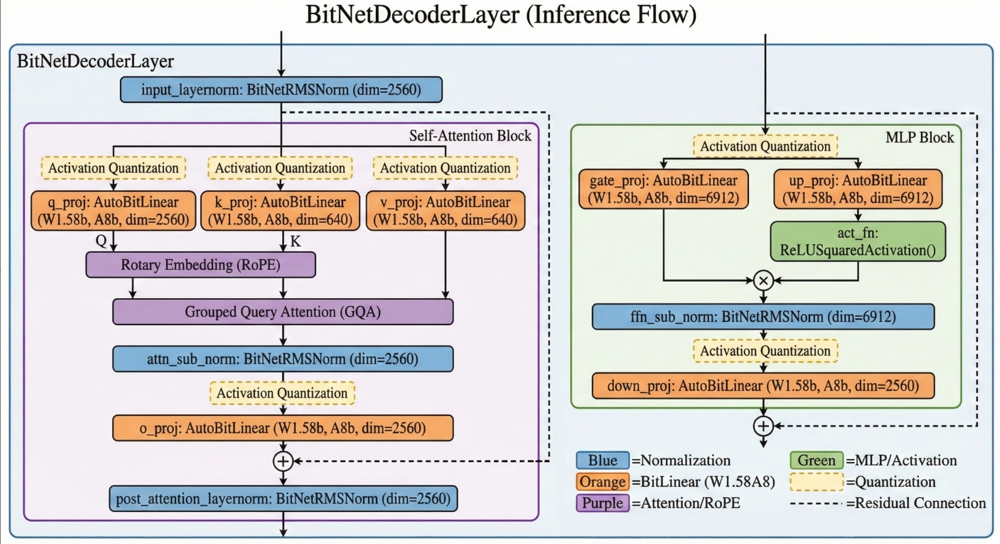

# 在 PyTorch 框架下 BitNet b1.58 模型 CPU 推理性能分析报告

**日期**：2026年1月19日  
**测试环境**：PyTorch (CPU only), AMD Ryzen 7 9700X 8-Core Processor  
**系统内存**：30 GB DDR5

## 1. 模型结构框架与运行机制

BitNet b1.58 沿用了标准的 Decoder-only Transformer 架构（类似 Llama），但将其核心的线性层替换为了 **BitLinear (1.58-bit)**。

### 1.1 模型结构

使用 `print(model)` 得到的输出如下：

```
BitNetForCausalLM(
  (model): BitNetModel(
    (embed_tokens): Embedding(128256, 2560)
    (layers): ModuleList(
      (0-29): 30 x BitNetDecoderLayer(
        (self_attn): BitNetAttention(
          (q_proj): AutoBitLinear(in_features=2560, out_features=2560, bias=False)
          (k_proj): AutoBitLinear(in_features=2560, out_features=640, bias=False)
          (v_proj): AutoBitLinear(in_features=2560, out_features=640, bias=False)
          (o_proj): AutoBitLinear(in_features=2560, out_features=2560, bias=False)
          (attn_sub_norm): BitNetRMSNorm((2560,), eps=1e-05)
        )
        (mlp): BitNetMLP(
          (gate_proj): AutoBitLinear(in_features=2560, out_features=6912, bias=False)
          (up_proj): AutoBitLinear(in_features=2560, out_features=6912, bias=False)
          (down_proj): AutoBitLinear(in_features=6912, out_features=2560, bias=False)
          (act_fn): ReLUSquaredActivation()
          (ffn_sub_norm): BitNetRMSNorm((6912,), eps=1e-05)
        )
        (input_layernorm): BitNetRMSNorm((2560,), eps=1e-05)
        (post_attention_layernorm): BitNetRMSNorm((2560,), eps=1e-05)
      )
    )
    (norm): BitNetRMSNorm((2560,), eps=1e-05)
    (rotary_emb): BitNetRotaryEmbedding()
  )
  (lm_head): Linear(in_features=2560, out_features=128256, bias=False)
)
```

### 1.2 模型推理流程详解

BitNet b1.58 的单次推理（Forward Pass）主要包含以下步骤：


#### 输入处理阶段

1. **Token Embedding** (`embed_tokens`)
   - 将输入的 Token ID（整数）映射为稠密向量表示
   - 输入：`[batch_size, seq_len]` → 输出：`[batch_size, seq_len, 2560]`
   - 本例中 batch_size=1, seq_len=3，故输出形状为 `[1, 3, 2560]`

2. **位置编码** (`rotary_emb`)
   - 应用 RoPE (Rotary Position Embedding) 为序列注入位置信息
   - 不改变张量形状，仅对特征维度施加旋转变换

#### Decoder Layer 循环处理 (30层)

每一层 `BitNetDecoderLayer` 的内部执行流程如下：

**Step 1: 输入归一化** (`input_layernorm`)

- 对输入特征进行 RMSNorm 归一化
- 作用：稳定训练过程，加速收敛

**Step 2: Self-Attention 模块** (`self_attn`)

1. **Q/K/V 投影**
   - `q_proj`: 查询矩阵投影，输入 `[1, 3, 2560]` → 输出 `[1, 3, 2560]`
   - `k_proj`: 键矩阵投影，输入 `[1, 3, 2560]` → 输出 `[1, 3, 640]`（使用 GQA 减少计算量）
   - `v_proj`: 值矩阵投影，输入 `[1, 3, 2560]` → 输出 `[1, 3, 640]`
   - **核心算子**：`AutoBitLinear` - 使用 1.58-bit 量化权重的线性变换

2. **注意力计算**
   - 计算注意力得分：$\text{Attention}(Q, K, V) = \text{Softmax}(\frac{QK^T}{\sqrt{d_k}})V$
   - 多头注意力合并（Multi-Head Attention）

3. **输出投影** (`o_proj`)
   - 将多头注意力结果投影回原始维度：`[1, 3, 2560]` → `[1, 3, 2560]`

4. **子层归一化** (`attn_sub_norm`)
   - 对 Attention 输出再次归一化

**Step 3: 残差连接**

- 将 Attention 输出与原始输入相加：`x = x + attn_output`

**Step 4: 后归一化** (`post_attention_layernorm`)

- 对残差连接后的结果进行归一化

**Step 5: MLP 前馈网络** (`mlp`)

1. **门控投影** (`gate_proj`)
   - 输入 `[1, 3, 2560]` → 输出 `[1, 3, 6912]`
   - 作用：扩展特征维度至 2.7 倍（6912/2560）

2. **上投影** (`up_proj`)
   - 输入 `[1, 3, 2560]` → 输出 `[1, 3, 6912]`
   - 作用：生成用于门控的激活值

3. **SwiGLU 激活**
   - 计算：$\text{SwiGLU}(x, W, V) = (\text{ReLU}^2(xW)) \odot (xV)$
   - ReLU² 激活函数：`act_fn` (ReLUSquaredActivation)
   - 元素级乘法：`gate_proj` ⊙ `up_proj`

4. **FFN 子层归一化** (`ffn_sub_norm`)
   - 对激活后的中间结果进行归一化

5. **下投影** (`down_proj`)
   - 输入 `[1, 3, 6912]` → 输出 `[1, 3, 2560]`
   - 作用：将膨胀的特征维度压缩回原始大小

**Step 6: 第二次残差连接**

- `x = x + mlp_output`

#### 输出阶段

1. **最终归一化** (`norm`)
   - 对所有 Decoder Layer 的输出进行最终归一化

2. **语言模型头** (`lm_head`)
   - 将隐藏状态映射到词表空间
   - 输入 `[1, 3, 2560]` → 输出 `[1, 3, 128256]`
   - 生成每个 Token 位置的下一个词的概率分布

---

## 2. 部分层具体运行数据 (Raw Data)

### Layer 0 (首层 - 包含初始化开销)

| Layer Name (层名) | Type (类型) | Input Shape (输入维度) | Time (ms) | Mem Delta (MB) | Abs Mem (MB) |
| --- | --- | --- | --- | --- | --- |
| layers.0.self_attn.q_proj | AutoBitLinear | [1, 3, 2560] | 3001.72 | 138.13 | 10053.4 |
| layers.0.self_attn.k_proj | AutoBitLinear | [1, 3, 2560] | 26.63 | 0.13 | 10053.6 |
| layers.0.self_attn.v_proj | AutoBitLinear | [1, 3, 2560] | 0.55 | 0.0 | 10053.6 |
| layers.0.self_attn.o_proj | AutoBitLinear | [1, 3, 2560] | 2.60 | 6.25 | 10061.3 |
| **layers.0.mlp.gate_proj** | **AutoBitLinear** | **[1, 3, 2560]** | **38.35** | **0.0** | **10061.3** |
| **layers.0.mlp.up_proj** | **AutoBitLinear** | **[1, 3, 2560]** | **10.45** | **0.31** | **10061.6** |
| **layers.0.mlp.down_proj** | **AutoBitLinear** | **[1, 3, 6912]** | **102.97** | **1.45** | **10063.1** |

> **数据解读**：第0层耗时显著高于后续层，这是由于包含了模型初始化、内存分配等一次性开销。注意 `q_proj` 的初始化耗时达到 **3001.72 ms**（约3秒），这是因为首次调用时 PyTorch 进行 JIT 编译和权重加载。

### Layer 14 (中段稳定运行阶段)

| Layer Name (层名) | Type (类型) | Input Shape (输入维度) | Time (ms) | Mem Delta (MB) | Abs Mem (MB) |
| --- | --- | --- | --- | --- | --- |
| layers.14.self_attn.q_proj | AutoBitLinear | [1, 3, 2560] | 3.52 | 0.0 | 10063.3 |
| layers.14.self_attn.k_proj | AutoBitLinear | [1, 3, 2560] | 0.49 | 0.0 | 10063.3 |
| layers.14.self_attn.v_proj | AutoBitLinear | [1, 3, 2560] | 0.61 | 0.0 | 10063.3 |
| layers.14.self_attn.o_proj | AutoBitLinear | [1, 3, 2560] | 2.79 | 0.0 | 10063.3 |
| **layers.14.mlp.gate_proj** | **AutoBitLinear** | **[1, 3, 2560]** | **12.14** | **0.0** | **10063.3** |
| **layers.14.mlp.up_proj** | **AutoBitLinear** | **[1, 3, 2560]** | **13.55** | **0.0** | **10063.3** |
| **layers.14.mlp.down_proj** | **AutoBitLinear** | **[1, 3, 6912]** | **10.80** | **0.0** | **10063.3** |

> **数据解读**：中间层的耗时已趋于稳定，MLP 模块耗时（36.49 ms）占总耗时的 **82.9%**，验证了 MLP 为主要性能瓶颈的结论。

---

## 3. 单层 (Decoder Layer) 平均耗时分布

我们将所有稳定运行的 Decoder Layer（Layer 1-29）数据进行汇总平均，得到单层内部的时间分布情况。

| 模块大类 | 具体组成 | 平均总耗时 (ms) | 占比 (%) |
| --- | --- | --- | --- |
| **MLP Block** | Gate + Up + Down | **40.68 ms** | **80.8%** |
| **Attention Block** | Q + K + V + O | **9.65 ms** | **19.2%** |

### 3.1 性能分布深度解析

#### 3.1.1 MLP Block 主导地位分析

**核心发现**：MLP Block 耗时占比高达 **80.8%**，成为单层推理的绝对性能瓶颈。

**原因剖析**：

1. **维度膨胀效应**
   - 隐藏层维度从 2560 → 6912，膨胀系数为 2.7 倍
   - 矩阵乘法计算量与维度平方成正比，导致 MLP 计算量剧增
   - 具体计算：
     - `gate_proj` & `up_proj`: 2560 × 6912 = **17.69M 参数** × 3 tokens = 53.07M OPs
     - `down_proj`: 6912 × 2560 = **17.69M 参数** × 3 tokens = 53.07M OPs
     - 总计：**318.51M OPs**（MLP 三算子合计）

2. **SwiGLU 架构开销**
   - 传统 FFN 只需 2 次矩阵乘法（Up + Down）
   - SwiGLU 需要 3 次矩阵乘法（Gate + Up + Down）
   - 额外开销：+50% 的线性变换计算量

**性能优化启示**：

- MLP Block 的加速将直接带来 **80%** 的性能提升潜力
- FPGA 设计应优先分配资源给 MLP 算子

#### 3.1.2 Attention Block 效率分析

**核心数据**：Attention Block 耗时 9.65 ms，占比 19.2%。

**效率特点**：

1. **GQA（Grouped Query Attention）优化**
   - K/V 投影维度缩减至 640（仅为 Q 的 1/4）
   - 大幅降低了 K/V 的计算量和 KV Cache 存储需求
   - 对比：标准 MHA 需要 K/V 各 2560 维

2. **计算量分布不均**
   - `q_proj` (4.40 ms) 和 `o_proj` (3.67 ms) 占主导
   - `k_proj` (0.86 ms) 和 `v_proj` (0.71 ms) 耗时较低
   - 原因：Q/O 矩阵规模为 2560×2560，K/V 仅为 2560×640

**FPGA 加速建议**：

- Attention 算子加速优先级次于 MLP
- 可采用流式计算优化 Softmax 和注意力矩阵乘法
- KV Cache 分页管理策略

---

## 4. 算子级性能分析 (Operator-Level Analysis)

模型稳定运行阶段（Stable Phase: Layers 1-29）的每种算子核心数据统计与分析如下：

### 4.1 核心数据统计表

| 算子名称 (Submodule) | 平均耗时 (ms) | 时间占比 (%) | 单次运算量 (OPs) | 算力占比 (%) | 有效算力 (GOPS) | 内存增量 (MB) |
| --- | --- | --- | --- | --- | --- | --- |
| **gate_proj** (MLP) | **14.06** | **27.93%** | **106.17 M** | **25.47%** | **7.55** | ~0.09 |
| **up_proj** (MLP) | **13.49** | **26.82%** | **106.17 M** | **25.47%** | **7.87** | ~0.07 |
| **down_proj** (MLP) | **13.13** | **26.09%** | **106.17 M** | **25.47%** | **8.09** | ~0.07 |
| **q_proj** (Attn) | 4.40 | 8.74% | 39.32 M | 9.43% | 8.94 | ~0 |
| **o_proj** (Attn) | 3.67 | 7.29% | 39.32 M | 9.43% | 10.72 | ~0 |
| **k_proj** (Attn) | 0.86 | 1.72% | 9.83 M | 2.36% | 11.37 | ~0 |
| **v_proj** (Attn) | 0.71 | 1.42% | 9.83 M | 2.36% | 13.76 | ~0 |

**总计每层**：

- **Total Time**: 50.32 ms
- **Total OPs**: 416,808,960 (约 417M)

### 4.2 深度分析

#### 4.2.1 算力瓶颈分析 (Compute Bound)

**核心发现**：MLP 三算子（gate_proj、up_proj、down_proj）成为计算瓶颈。

**数据支撑**：

1. **运算量占比**
   - MLP 三算子合计：106.17M × 3 = **318.51M OPs**
   - 总运算量（所有算子）：约 **416.81M OPs**
   - MLP 占比：**76.4%**

2. **耗时占比**
   - MLP 三算子合计：14.06 + 13.49 + 13.13 = **40.68 ms**
   - 单层总耗时：50.32 ms
   - 耗时占比：**80.8%**

运算量与耗时具有一致性，表明模型处在 **Compute Bound** 状态，即计算量主导性能。

**对比分析**：

| 算子类型 | 单次运算量 | 平均耗时 | 运算效率 (GOPS) |
| --- | --- | --- | --- |
| gate_proj | 106.17M | 14.06 ms | **7.55 GOPS** |
| up_proj | 106.17M | 13.49 ms | **7.87 GOPS** |
| down_proj | 106.17M | 13.13 ms | **8.09 GOPS** |
| q_proj | 39.32M | 4.40 ms | 8.94 GOPS |
| o_proj | 39.32M | 3.67 ms | 10.72 GOPS |

- MLP 算子运算效率（7.55-8.09 GOPS）略低于 Attention 算子（8.94-13.76 GOPS），这可能是因为 MLP 的矩阵更大，Cache 命中率降低。
- 但整体算力（7-14 GOPS）远低于 CPU 理论峰值，**算力利用率较低**，存在巨大优化空间，FPGA 加速潜力巨大。

#### 4.2.2 内存墙效应分析 (Memory Wall)

**核心问题**：为何 CPU 算力利用率较低？

**根本原因**：**内存墙（Memory Wall）**—— CPU 在等待数据，而非真正计算。

1. **有效算力分析**
   - CPU 理论峰值（FP32 单精度）：
     - AMD Ryzen 7 9700X：8核 × 高主频 + AVX512 支持
     - 理论峰值可达数百 GFLOPS
   - 实测有效算力：**7.55-13.76 GOPS**
   - 利用率：**约 2-5%**

2. **内存带宽瓶颈计算**
   - 每次 gate_proj 需读取：
     - 权重：2560 × 6912 × 2 bits / 8 ≈ **4.42 MB**（三值权重）
     - 输入：1 × 3 × 2560 × 4 bytes = **0.03 MB**（FP32 激活值）
     - 量化参数（scale、zero_point 等）：约 **0.5 MB**
     - 总计：约 **5 MB** 数据需从内存读取
   - 单次操作耗时：14.06 ms
   - 实际带宽需求：5 MB / 14.06 ms ≈ **356 MB/s**

3. **与理论带宽对比**
   - DDR5 理论带宽：约 **76.8 GB/s** (双通道 DDR5-4800)
   - 实测带宽利用率：356 MB/s / 76800 MB/s ≈ **0.46%**

4. **矛盾现象解析**
   - 带宽利用率极低
   - **说明问题不在带宽本身，而在 Cache Miss 和数据局部性**
   - 权重矩阵可以放入 L3 Cache，但多个算子竞争导致频繁换出

**内存墙的真正成因**：

1. **数据重用率低**
   - Batch size = 1，序列长度 = 3，数据重用机会极少
   - 每个权重矩阵元素仅被使用 3 次（序列长度）

2. **三值量化的副作用**
   - 虽然存储降低，但解量化过程需要：
     - 读取压缩权重（2 bits）
     - 读取 scale 参数
     - 计算：`real_weight = quantized_weight * scale`
   - 额外的计算和内存访问抵消了部分带宽优势

#### 4.2.3 算子异常现象分析

**异常 1：Layer 0 的 q_proj 耗时 3001 ms**

- **正常层**：q_proj 约 4.4 ms
- **第 0 层**：3001 ms
- **原因推测**：
  1. 首次调用时 PyTorch 进行 JIT 编译
  2. 权重从 CPU 内存加载到 Cache（Cold Start）
  3. 库初始化
  4. Python GIL（全局解释器锁）争用
- **验证方法**：观察 Layer 1 已恢复正常
- **FPGA 优势**：无 JIT 编译，上电即可全速运行

**异常 2：内存占用稳定**

- Layer 0 后内存增量接近 0
- 说明 PyTorch 内存池机制正常工作
- FPGA 实现时可精确控制内存分配，避免浪费

---

## 5. 总结与 FPGA 加速展望

### 5.1 关键发现

| 指标 | 数值 | 说明 |
| --- | --- | --- |
| 模型加载内存 | ~9.4 GB | 2B 参数 FP32 格式 |
| 单次推理耗时 | ~4.8 秒 | 30 层全部执行 |
| 每层平均耗时 | ~50 ms | 稳定运行阶段 |
| MLP 耗时占比 | **80.8%** | 性能瓶颈 |
| 有效算力 | 7-14 GOPS | CPU 利用率极低 |

### 5.2 FPGA 加速潜力分析

本报告证实了将 BitNet 模型的 **BitLinear 算子** 迁移至 FPGA 进行加速具有极高的可行性和必要性：

1. **MLP Block 加速优先级最高**
   - 占据 80.8% 的计算时间
   - 三算子（gate_proj、up_proj、down_proj）结构相似，可复用加速器设计
   - FPGA 可实现专用三值矩阵乘法单元，避免通用 CPU 的解量化开销

2. **内存墙突破可能**
   - FPGA 片上 BRAM/URAM 可缓存权重矩阵
   - 消除 Cache Miss，实现确定性延迟
   - 流式处理架构最大化带宽利用率

3. **量化友好特性**
   - 1.58-bit 权重 (+1, 0, -1) 可用简单加减法实现
   - 无需乘法器，大幅降低资源消耗
   - 适合 FPGA 的查找表（LUT）实现

### 5.3 下一步工作

1. 设计 BitLinear 算子的 SystemVerilog RTL 实现
2. 在 Zynq FPGA 平台上验证单算子性能
3. 构建完整的加速器流水线
4. 与 RISC-V 软核协同工作，实现灵活的推理控制

---

**附录**：完整数据文件

- [raw_layer_data.csv](raw_layer_data.csv) - 所有层的原始性能数据
- [final_operator_benchmark.csv](final_operator_benchmark.csv) - 算子级统计汇总
- [inference_profile_report.json](inference_profile_report.json) - JSON 格式完整报告数据
