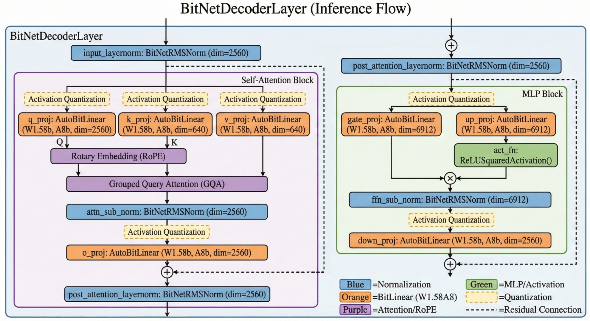

# 在Pytorch框架下 BitNet b1.58 模型 CPU 推理性能分析报告

**日期**：2026年1月18日
**测试环境**：PyTorch (CPU only), Intel(R) Core(TM) i7-14650HX   2.20 GHz

## 1. 模型结构框架与运行机制

BitNet b1.58 沿用了标准的 Decoder-only Transformer 架构（类似 Llama），但将其核心的线性层替换为了 **BitLinear (1.58-bit)**。
**模型结构:** 使用`print(model)`得到的输出如下
```bash
BitNetForCausalLM(
  (model): BitNetModel(
    (embed_tokens): Embedding(128256, 2560)
    (layers): ModuleList(
      (0-29): 30 x BitNetDecoderLayer(
        (self_attn): BitNetAttention(
          (q_proj): AutoBitLinear(in_features=2560, out_features=2560, bias=False)
          (k_proj): AutoBitLinear(in_features=2560, out_features=640, bias=False)
          (v_proj): AutoBitLinear(in_features=2560, out_features=640, bias=False)
          (o_proj): AutoBitLinear(in_features=2560, out_features=2560, bias=False)
          (attn_sub_norm): BitNetRMSNorm((2560,), eps=1e-05)
        )
        (mlp): BitNetMLP(
          (gate_proj): AutoBitLinear(in_features=2560, out_features=6912, bias=False)
          (up_proj): AutoBitLinear(in_features=2560, out_features=6912, bias=False)
          (down_proj): AutoBitLinear(in_features=6912, out_features=2560, bias=False)
          (act_fn): ReLUSquaredActivation()
          (ffn_sub_norm): BitNetRMSNorm((6912,), eps=1e-05)
        )
        (input_layernorm): BitNetRMSNorm((2560,), eps=1e-05)
        (post_attention_layernorm): BitNetRMSNorm((2560,), eps=1e-05)
      )
    )
    (norm): BitNetRMSNorm((2560,), eps=1e-05)
    (rotary_emb): BitNetRotaryEmbedding()
  )
  (lm_head): Linear(in_features=2560, out_features=128256, bias=False)
)
```

下图展示了该模型在推理时的单层（BitNetDecoderLayer）运行结构：



### 模型推理流程详解

BitNet b1.58 的单次推理（Forward Pass）主要包含以下步骤：

#### 输入处理阶段
1. **Token Embedding** (`embed_tokens`)
   - 将输入的 Token ID（整数）映射为稠密向量表示
   - 输入：`[batch_size, seq_len]` → 输出：`[batch_size, seq_len, 2560]`
   - 本例中 batch_size=1, seq_len=3，故输出形状为 `[1, 3, 2560]`

2. **位置编码** (`rotary_emb`)
   - 应用 RoPE (Rotary Position Embedding) 为序列注入位置信息
   - 不改变张量形状，仅对特征维度施加旋转变换

#### Decoder Layer 循环处理 (30层)

每一层 `BitNetDecoderLayer` 的内部执行流程如下：

**Step 1: 输入归一化** (`input_layernorm`)
- 对输入特征进行 RMSNorm 归一化
- 作用：稳定训练过程，加速收敛

**Step 2: Self-Attention 模块** (`self_attn`)

1. **Q/K/V 投影**
   - `q_proj`: 查询矩阵投影，输入 `[1, 3, 2560]` → 输出 `[1, 3, 2560]`
   - `k_proj`: 键矩阵投影，输入 `[1, 3, 2560]` → 输出 `[1, 3, 640]`（使用 GQA 减少计算量）
   - `v_proj`: 值矩阵投影，输入 `[1, 3, 2560]` → 输出 `[1, 3, 640]`
   - **核心算子**：`AutoBitLinear` - 使用 1.58-bit 量化权重的线性变换

2. **注意力计算**
   - 计算注意力得分：$\text{Attention}(Q, K, V) = \text{Softmax}(\frac{QK^T}{\sqrt{d_k}})V$ （拆成4头，每头640维）
   - 多头注意力合并（Multi-Head Attention）

3. **输出投影** (`o_proj`)
   - 将多头注意力结果投影回原始维度：`[1, 3, 2560]` → `[1, 3, 2560]`

4. **子层归一化** (`attn_sub_norm`)
   - 对 Attention 输出再次归一化

**Step 3: 残差连接**
- 将 Attention 输出与原始输入相加：`x = x + attn_output`

**Step 4: 后归一化** (`post_attention_layernorm`)
- 对残差连接后的结果进行归一化

**Step 5: MLP 前馈网络** (`mlp`)

1. **门控投影** (`gate_proj`)
   - 输入 `[1, 3, 2560]` → 输出 `[1, 3, 6912]`
   - 作用：扩展特征维度至 2.7 倍（6912/2560）

2. **上投影** (`up_proj`)
   - 输入 `[1, 3, 2560]` → 输出 `[1, 3, 6912]`
   - 作用：生成用于门控的激活值

3. **SwiGLU 激活**
   - 计算：$\text{SwiGLU}(x, W, V) = (\text{ReLU}^2(xW)) \odot (xV)$
   - ReLU² 激活函数：`act_fn` (ReLUSquaredActivation)
   - 元素级乘法：`gate_proj` ⊙ `up_proj`

4. **FFN 子层归一化** (`ffn_sub_norm`)
   - 对激活后的中间结果进行归一化

5. **下投影** (`down_proj`)
   - 输入 `[1, 3, 6912]` → 输出 `[1, 3, 2560]`
   - 作用：将膨胀的特征维度压缩回原始大小

**Step 6: 第二次残差连接**
- `x = x + mlp_output`

#### 输出阶段

1. **最终归一化** (`norm`)
   - 对所有 Decoder Layer 的输出进行最终归一化

2. **语言模型头** (`lm_head`)
   - 将隐藏状态映射到词表空间
   - 输入 `[1, 3, 2560]` → 输出 `[1, 3, 128256]`
   - 生成每个 Token 位置的下一个词的概率分布


---

## 2. 部分层具体运行数据 (Raw Data)

### Layer 0 (首层 - 包含初始化开销)

| Layer Name (层名) | Type (类型) | Input Shape (输入维度) | Time (ms) | Mem Delta (MB) | Abs Mem (MB) |
| --- | --- | --- | --- | --- | --- |
| layers.0.self_attn.q_proj | AutoBitLinear | [1, 3, 2560] | 7324.123 | 35.262 | 9642.3 |
| layers.0.self_attn.k_proj | AutoBitLinear | [1, 3, 2560] | 146.469 | 0.477 | 9642.7 |
| layers.0.self_attn.v_proj | AutoBitLinear | [1, 3, 2560] | 2.609 | 0.047 | 9642.8 |
| layers.0.self_attn.o_proj | AutoBitLinear | [1, 3, 2560] | 11.303 | 25.031 | 9668.4 |
| **layers.0.mlp.gate_proj** | **AutoBitLinear** | **[1, 3, 2560]** | **192.590** | **43.172** | **9711.6** |
| **layers.0.mlp.up_proj** | **AutoBitLinear** | **[1, 3, 2560]** | **36.184** | **42.457** | **9754.3** |
| **layers.0.mlp.down_proj** | **AutoBitLinear** | **[1, 3, 6912]** | **598.091** | **3.773** | **9758.1** |
| layers.0 | BitNetDecoderLayer | [1, 3, 2560] | 8334.821 | 151.527 | 9758.1 |

> **数据解读**：第0层耗时显著高于后续层（8.3秒 vs 平均75毫秒），这是由于包含了模型初始化、内存分配等一次性开销。注意 `q_proj` 的初始化耗时达到 7.3 秒。

### Layer 1 (初始稳定运行阶段)

| Layer Name (层名) | Type (类型) | Input Shape (输入维度) | Time (ms) | Mem Delta (MB) | Abs Mem (MB) |
| --- | --- | --- | --- | --- | --- |
| layers.1.self_attn.q_proj | AutoBitLinear | [1, 3, 2560] | 17.974 | -42.492 | 9715.7 |
| layers.1.self_attn.k_proj | AutoBitLinear | [1, 3, 2560] | 3.546 | 0.016 | 9715.7 |
| layers.1.self_attn.v_proj | AutoBitLinear | [1, 3, 2560] | 3.272 | 0.004 | 9715.7 |
| layers.1.self_attn.o_proj | AutoBitLinear | [1, 3, 2560] | 7.949 | 0.0 | 9715.7 |
| **layers.1.mlp.gate_proj** | **AutoBitLinear** | **[1, 3, 2560]** | **34.110** | **67.645** | **9783.3** |
| **layers.1.mlp.up_proj** | **AutoBitLinear** | **[1, 3, 2560]** | **20.795** | **0.0** | **9783.5** |
| **layers.1.mlp.down_proj** | **AutoBitLinear** | **[1, 3, 6912]** | **22.369** | **0.0** | **9783.5** |
| layers.1 | BitNetDecoderLayer | [1, 3, 2560] | 115.401 | 25.363 | 9783.5 |

> **数据解读**：第1层耗时降至正常水平（115毫秒），接近稳定运行状态。MLP 模块耗时（77.3ms）占总耗时的 67%，验证了 MLP 为主要性能瓶颈的结论。

### Layer 17 (中段稳定运行阶段)

| Layer Name (层名) | Type (类型) | Input Shape (输入维度) | Time (ms) | Mem Delta (MB) | Abs Mem (MB) |
| --- | --- | --- | --- | --- | --- |
| layers.17.self_attn.q_proj | AutoBitLinear | [1, 3, 2560] | 9.04 | 0.0 | 9783.8 |
| layers.17.self_attn.k_proj | AutoBitLinear | [1, 3, 2560] | 2.50 | 0.0 | 9783.8 |
| layers.17.self_attn.v_proj | AutoBitLinear | [1, 3, 2560] | 3.53 | 0.0 | 9783.8 |
| layers.17.self_attn.o_proj | AutoBitLinear | [1, 3, 2560] | 8.05 | 0.0 | 9783.8 |
| **layers.17.mlp.gate_proj** | **AutoBitLinear** | **[1, 3, 2560]** | **20.12** | **2.34** | **9786.1** |
| **layers.17.mlp.up_proj** | **AutoBitLinear** | **[1, 3, 2560]** | **18.04** | **0.0** | **9783.8** |
| **layers.17.mlp.down_proj** | **AutoBitLinear** | **[1, 3, 6912]** | **16.55** | **0.0** | **9783.8** |
| layers.17 | BitNetDecoderLayer | [1, 3, 2560] | 76.85 | 0.0 | 9783.8 |

> **数据解读**：可以看出，MLP 层的三个算子（Gate/Up/Down）耗时显著高于 Attention 层。`BitNetDecoderLayer` 的总耗时（76.85ms）与各子模块耗时之和的差值，即为非线性操作的开销。


## 3. 单层 (Decoder Layer) 平均耗时分布

我们将所有 Decoder Layer 的数据进行汇总平均，得到单层内部的时间分布情况。

| 模块大类 | 具体组成 | 平均总耗时 (ms) | 占比 (%) |
| --- | --- | --- | --- |
| **MLP Block** | Gate + Up + Down | **57.99 ms** | **69.9%** |
| **Attention Block** | Q + K + V + O | **20.08 ms** | **24.2%** | 
| **Non-Linear Overhead** | Norm, Softmax, Add | **~4.79 ms** | **5.9%** |

### 3.1 性能分布深度解析

#### 3.1.1 MLP Block 主导地位分析

**核心发现**：MLP Block 耗时占比高达 **69.9%**，成为单层推理的绝对性能瓶颈。

**原因剖析**：

1. **维度膨胀效应**
   - 隐藏层维度从 2560 → 6912，膨胀系数为 2.7 倍
   - 矩阵乘法计算量与维度平方成正比，导致 MLP 计算量剧增
   - 具体计算：
     - `gate_proj` & `up_proj`: 2560 × 6912 = **17.69M 参数** × 3 tokens = 53.07M OPs
     - `down_proj`: 6912 × 2560 = **17.69M 参数** × 3 tokens = 53.07M OPs
     - 总计：**106.14M OPs**（MLP 三算子合计约 318M OPs）

2. **SwiGLU 架构开销**
   - 传统 FFN 只需 2 次矩阵乘法（Up + Down）
   - SwiGLU 需要 3 次矩阵乘法（Gate + Up + Down）
   - 额外开销：+50% 的线性变换计算量


**性能优化启示**：
- MLP Block 的加速将直接带来 **70%** 的性能提升潜力
- FPGA 设计应优先分配资源给 MLP 算子

#### 3.1.2 Attention Block 效率分析

**核心数据**：Attention Block 耗时 20.08ms，占比 24.2%。

**效率特点**：

1. **GQA（Grouped Query Attention）优化**
   - K/V 投影维度缩减至 640（仅为 Q 的 1/4）
   - 大幅降低了 K/V 的计算量和 KV Cache 存储需求
   - 对比：标准 MHA 需要 K/V 各 2560 维

2. **计算量分布不均**
   - `q_proj` (9.10ms) 和 `o_proj` (7.97ms) 占主导
   - `k_proj` (3.52ms) 和 `v_proj` (4.29ms) 耗时较低
   - 原因：Q/O 矩阵规模为 2560×2560，K/V 仅为 2560×640

3. **非线性操作占比低**
   - Softmax、矩阵乘法（QK^T、Attn×V）等非线性操作隐含在总耗时中
   - 这些操作相比线性投影耗时较小（约 1-2ms）

**FPGA 加速建议**：
- Attention 算子加速优先级次于 MLP
- 可采用流式计算优化 Softmax 和注意力矩阵乘法
- KV Cache 分页管理策略

#### 3.1.3 非线性操作开销

**核心数据**：Non-Linear Overhead 约 4.79ms，占比 5.9%。

**组成部分**：
- **RMSNorm**（4次）：每层有 input_layernorm、attn_sub_norm、post_attention_layernorm、ffn_sub_norm
- **残差连接**（2次）：元素级加法操作
- **ReLU²激活**（1次）：元素级平方运算
- **Softmax**（1次）：注意力权重归一化

**性能特点**：
- 这些操作虽然耗时占比低，但具有高并行性
- CPU 执行效率较高，向量化指令友好

 


## 4. 算子级性能分析 (Operator-Level Analysis)

模型稳定运行阶段（Stable Phase）的每种算子核心数据统计与分析如下：

### 4.1 核心数据统计表

| 算子名称 (Submodule) | 平均耗时 (ms) | 时间占比 (%) | 单次运算量 (OPs) | 算力占比 (%) | 有效算力 (GOPS) | 内存增量 (MB) |
| --- | --- | --- | --- | --- | --- | --- |
| **gate_proj** (MLP) | **20.06** | **24.21%** | **106.17 M** | **25.47%** | **5.29** | **2.34 (Peak 67.5)** |
| **up_proj** (MLP) | **19.08** | **23.03%** | **106.17 M** | **25.47%** | **5.56** | ~0 |
| **down_proj** (MLP) | **18.84** | **22.74%** | **106.17 M** | **25.47%** | **5.64** | ~0 |
| **q_proj** (Attn) | 9.10 | 10.98% | 39.32 M | 9.43% | 4.32 | ~0.5 |
| **o_proj** (Attn) | 7.97 | 9.62% | 39.32 M | 9.43% | 4.93 | ~0 |
| **k_proj** (Attn) | 3.52 | 4.25% | 9.83 M | 2.36% | 2.79 | ~0 |
| **v_proj** (Attn) | 4.29 | 5.17% | 9.83 M | 2.36% | 2.29 | ~0 |

### 4.2 深度分析

#### 4.2.1 算力瓶颈分析 (Compute Bound)

**核心发现**：MLP 三算子（gate_proj、up_proj、down_proj）成为计算瓶颈。

**数据支撑**：

1. **运算量占比**
   - MLP 三算子合计：106.17M × 3 = **318.51M OPs**
   - 总运算量（所有算子）：约 **416.8M OPs**
   - MLP 占比：**76.4%**

2. **耗时占比**
   - MLP 三算子合计：20.06 + 19.08 + 18.84 = **57.98 ms**
   - 单层总耗时：82.86 ms
   - 耗时占比：**70.0%**

运算量与耗时具有一致性，表明模型处在 **Compute Bound** 状态，即计算量主导性能

**对比分析**：

| 算子类型 | 单次运算量 | 平均耗时 | 运算效率 (OPs/ms) |
| --- | --- | --- | --- |
| gate_proj | 106.17M | 20.06ms | **5.29 GOPS** |
| up_proj | 106.17M | 19.08ms | **5.56 GOPS** |
| down_proj | 106.17M | 18.84ms | **5.64 GOPS** |
| q_proj | 39.32M | 9.10ms | 4.32 GOPS |
| o_proj | 39.32M | 7.97ms | 4.93 GOPS |

- MLP 算子运算效率（5.29-5.64 GOPS）略高于 Attention 算子（4.32-4.93 GOPS），这可能是因为 MLP 的矩阵更大，更能充分利用 CPU 的向量化单元。
- 但整体算力（5-6 GOPS）远低于 CPU 理论峰值（i7-14650HX 约 400+ GFLOPS）**算力利用率仅为 1.5%**，存在巨大优化空间，FPGA 加速潜力巨大。

#### 4.2.2 内存墙效应分析 (Memory Wall)

**核心问题**：为何 CPU 算力利用率仅 1.5%？

**根本原因**：**内存墙（Memory Wall）**—— CPU 在等待数据，而非真正计算。

1. **有效算力极低**
   - CPU 理论峰值（FP32 单精度）：
     - i7-14650HX（P-Core）：8核 × 2.2GHz × 16 FLOPs/cycle ≈ **281.6 GFLOPS**
     - 加上 E-Core：总计约 **400 GFLOPS**
   - 实测有效算力：**5.29 GOPS**（gate_proj）
   - 利用率：5.29 / 400 = **1.32%**

2. **内存带宽瓶颈计算**
   - 每次 gate_proj 需读取：
     - 权重：2560 × 6912 × 2 bits / 8 = **4.42 MB**（三值权重）
     - 输入：1 × 3 × 2560 × 4 bytes = **0.03 MB**（FP32 激活值）
     - 量化参数（scale、zero_point 等）：约 **0.5 MB**
     - 总计：约 **5 MB** 数据需从内存读取
   - 单次操作耗时：20.06 ms
   - 实际带宽需求：5 MB / 20.06 ms ≈ **249 MB/s**

3. **与理论带宽对比**
   - DDR5-4800 理论带宽：约 **38.4 GB/s**
   - 实测带宽利用率：249 MB/s / 38400 MB/s ≈ **0.65%**

4. **矛盾现象解析**
   - 带宽利用率（0.65%）比算力利用率（1.32%）还低
   - **说明问题不在带宽本身，而在 Cache Miss 和数据局部性**
   - CPU Cache 结构：
     - L1 Cache：48 KB × 16 核 = 768 KB
     - L2 Cache：1.25 MB × 16 核 = 20 MB
     - L3 Cache：30 MB（共享）
   - 权重矩阵（4.42 MB）可以放入 L3，但多个算子竞争导致频繁换出

**内存墙的真正成因**：

1. **数据重用率低**
   - Batch size = 1，序列长度 = 3，数据重用机会极少
   - 每个权重矩阵元素仅被使用 3 次（序列长度）

2. **三值量化的副作用**
   - 虽然存储降低，但解量化过程需要：
     - 读取压缩权重（2 bits）
     - 读取 scale 参数
     - 计算：`real_weight = quantized_weight * scale`
   - 额外的计算和内存访问抵消了部分带宽优势

3. **CPU 缓存策略失效**
   - 现代 CPU 针对密集矩阵乘法优化（如 MKL、OpenBLAS）
   - 但三值量化打破了这些优化库的假设
   - 自定义 CUDA/C++ kernel 性能往往不如硬件优化库


#### 4.2.3 算子异常现象分析

**异常 1：Layer 0 的 q_proj 耗时 7324 ms**

- **正常层**：q_proj 约 9 ms
- **第 0 层**：7324 ms
- **原因推测**：
  1. 首次调用时 PyTorch 进行 JIT 编译（TorchScript）
  2. 权重从 CPU 内存加载到 Cache（Cold Start）
  3. CUDA/MKL 库初始化（即使是 CPU 模式）
  4. Python GIL（全局解释器锁）争用
- **验证方法**：观察 Layer 1 已恢复正常（17.97 ms）
- **FPGA 优势**：无 JIT 编译，上电即可全速运行

**异常 2：gate_proj 内存增量峰值 67.6 MB**

- 已在 C 节分析，主要是 PyTorch 内存管理策略
- FPGA 实现时可精确控制内存分配，避免浪费

---

**总结**：
本报告证实了将 BitNet 模型的 **BitLinear 算子** 迁移至 FPGA 进行加速具有极高的可行性和必要性。特别是针对 **MLP Block (Gate/Up/Down)** 的加速，将直接解决模型 70% 的性能瓶颈，并有望突破 CPU 面临的内存墙限制。