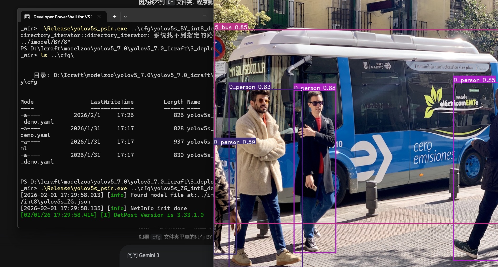

# 集创赛复旦微 FMQL30TAI 赛道 - YOLOv5 部署与仿真工作总结报告

2026/2/1 updated by LCJ

---

## 一、 工作概述

针对集创赛复旦微 FMQL30TAI 赛道任务二的要求，我们在 Windows 11 环境下，通过搭建 Icraft 工具链、配置 WSL 交叉编译环境以及 Visual Studio C++ 本地开发环境，成功完成了 **YOLOv5s 模型的量化编译**、**板载程序交叉编译**以及**PC 端 C++ 仿真验证**。最终实现了在无实物板卡的情况下，验证了模型转换的有效性和应用程序逻辑的正确性，为后续实板部署打下了坚实基础。

---

## 二、 核心工作内容与实施步骤

### 1. 模型量化与编译 (Model Compilation)

**操作内容**：
* 使用 `uv` 工具管理 Python 环境，解决了依赖包缺失问题。
* 利用 `1_save.py` 将 PyTorch 模型导出为 TorchScript 格式（`.pt`）。
* 使用 **Icraft Compiler** 对模型进行解析（Parse）、优化（Optimize）、量化（Quantize，FP32转Int8）和指令生成（Generate）。

**产出物**：
* `yolov5s_ZG.json`（计算图结构）
* `yolov5s_ZG.raw`（量化后的权重参数）

### 2. 交叉编译环境构建 (Cross-Compilation Setup)

**操作内容**：
* 在 Windows 上启用 **WSL (Ubuntu 20.04)** 子系统。
* 配置 **Multi-arch 支持**，使 x86 架构的电脑能安装 ARM64 架构的库。
* 解决 `zlib1g-dev:arm64` 和 `libdw-dev:arm64` 等依赖缺失问题（修改 `sources.list` 为 Ubuntu Ports 源）。
* 使用 `cmake` 和 `make` 编译了面向开发板的 C++ 控制程序。

**产出物**：
* `yolov5s_psin`（Linux ARM64 可执行文件，用于未来在开发板上运行）。

### 3. Windows 本地仿真 (PC Simulation)

**操作内容**：
* 配置 **Visual Studio 2022** C++ 开发环境及 Icraft 第三方依赖库。
* 使用 **Developer PowerShell** 解决 CMake 路径识别问题。
* 编译生成 Windows 版本的 C++ 应用程序（`.exe`）。
* 修改配置文件 (`.yaml`)，将运行后端（Backend）指定为 `Host`，并修正模型路径为 `ZG`（诸葛）架构。

**产出物**：
* `yolov5s_psin.exe`（Windows x64 可执行文件，**用于本地验证逻辑**）。
* **仿真结果图**：成功在测试图片上绘制出检测框（Bounding Box）。

---
## 三、 关键技术原理 (Technical Principles)

这一路走来，我们其实运用了嵌入式 AI 开发中三个最重要的核心概念：

### 1. 量化与编译 (Quantization & Compilation)

* **原理**：复旦微的 NPU（神经网络处理器）计算 Int8（8位整数）比计算 Float32（32位浮点数）快得多。
* **我们做了什么**：Icraft 编译器扮演了“翻译官”的角色。它不仅把模型“变瘦”了（量化），还把通用的神经网络层翻译成了芯片 NPU 能直接听懂的专用指令集。

### 2. 交叉编译 (Cross-Compilation)

* **原理**：开发板（ARM架构）性能有限，不适合承担繁重的编译代码任务；而电脑（x86架构）性能强但架构不同，生成的程序板子跑不了。
* **我们做了什么**：我们在电脑的 WSL 里模拟了一套 ARM 的环境（安装 `g++-aarch64` 等工具）。这就像在电脑上建立了一条“流水线”，专门生产给板子用的零件。

### 3. 异构计算与后端抽象 (Heterogeneous Computing & Backend)

* **原理**：Icraft 的代码设计采用了“后端抽象”技术。同一套 C++ 代码（`yolov5s_psin.cpp`），可以通过配置文件切换“大脑”。
* **我们做了什么**：
* **Host Backend**：在电脑上仿真时，代码调用 CPU 来模拟 NPU 的行为（慢，但方便调试）。
* **ZG330 Backend**：未来在板子上运行时，代码会直接调用 NPU 硬件进行加速（快，是最终目标）。

---

## 四、 最终仿真效果 (Simulation Results)

* **输入**：标准的街道测试图片。
* **处理**：Windows 端 C++ 程序加载量化后的 YOLOv5 模型，在 CPU 上模拟推理过程。
* **输出**：程序正确解析了模型输出的张量数据，经过 NMS（非极大值抑制）后处理，在图片上精准标注了：
* `Person` (行人) - 置信度约 0.85+
* `Bus` (公交车) - 置信度约 0.85

* **结论**：**模型编译正确，后处理代码逻辑无误，环境搭建成功。**

---

## 五、 下一步计划 (Next Steps)

现在“万事俱备，只欠东风（开发板）”。当板子到了之后，只需要做简单的“搬运工”工作：

1. **烧录系统**：给板子插上 SD 卡启动。
2. **文件拷贝**：
* 把 WSL 里编译好的 `yolov5s_psin` (ARM版) 拷进去。
* 把 `imodel` (模型文件) 拷进去。

3. **修改配置**：把 `.yaml` 文件里的 `run_backend` 改回 `zg330`。
4. **运行**：直接运行，即可看到 NPU 极速处理摄像头的画面！

---
