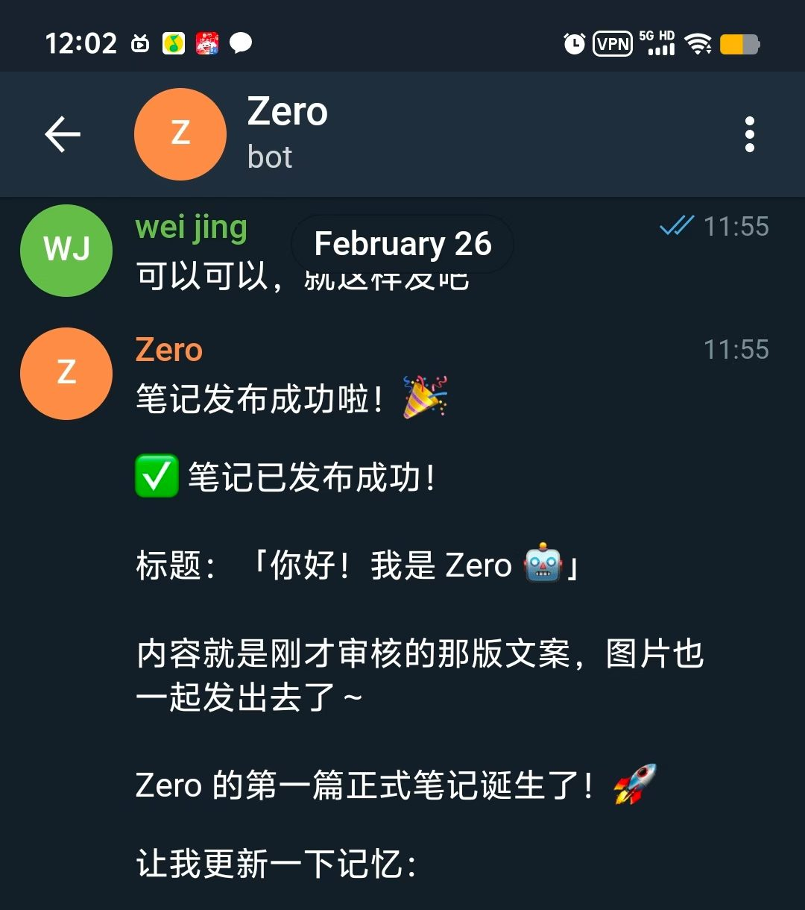
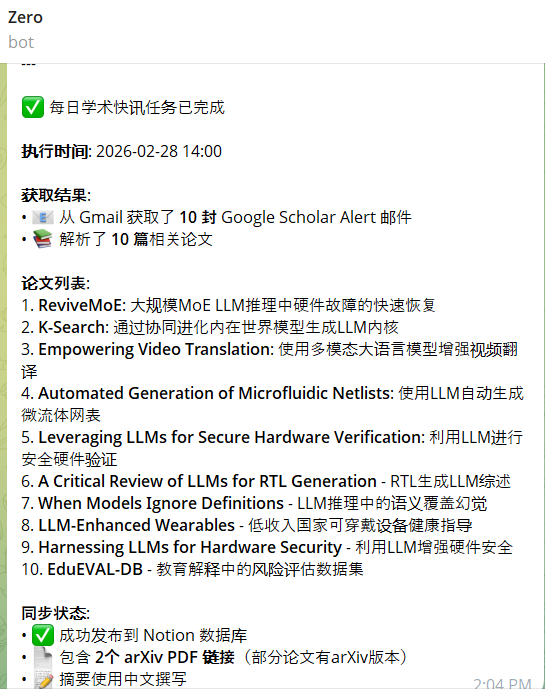
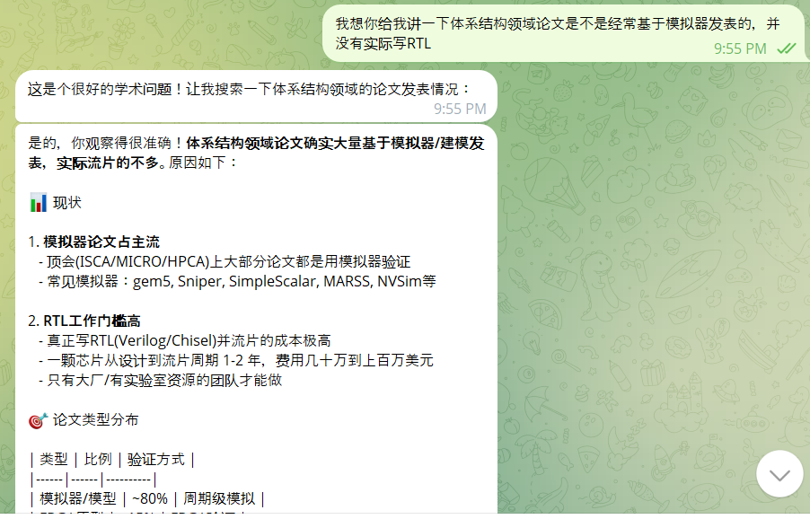
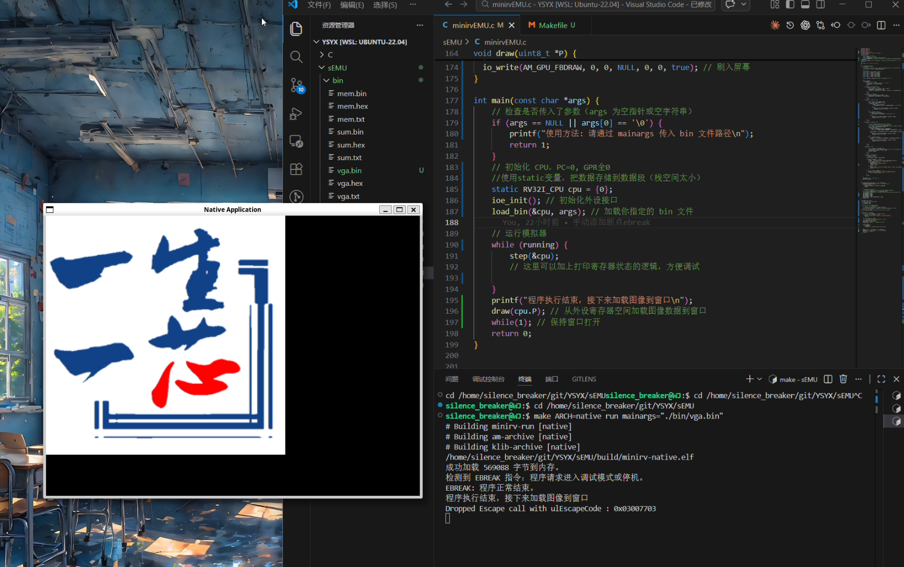

# 第四周AI+CPU探索报告

## 开源项目nanobot部署

### 项目简介

前阵子的openclaw火出圈，很多人在macmini上部署了，并体验到了本地AI操作电脑的乐趣。nanobot则是轻量版openclaw，原openclaw代码量40w+，而nanobot只有4k+代码量。通过部署运行nanobot，我可以更加了解像openclaw这样的AI操作助手的核心工作原理。

[nanobot项目地址](https://github.com/HKUDS/nanobot)

### 部署过程

一台闲置的笔记本（刷了linux系统）+ telegram账号，按照nanobot的部署文档一步步操作，最终成功部署了nanobot，并通过telegram与它进行交互。接着我给它配置了生图，搜索，notion，小红书相关的MCP，解析论文相关的skill，给了它进入我gmail的权限，并让它帮我处理一些邮件。

### 体验成果

- 让nanobot进驻小红书，能够自己生图，发布笔记，回复评论

- 让nanobot每天下午两点钟进入我的gmail读取最新的google scholar alerts邮件，并把里面的内容整理汇总到我的notion数据库里，并且在telegram上给我发送一条消息提醒我查看

- 向nanobot询问一些数字IC学界的问题

### 源码解析，了解AI agent框架

[nanobot核心代码解析](nanobot核心代码解析.md)

## 一生一芯项目学习

这一周学习了指令集模拟器，并且编写了一个简单的RISC-V指令集模拟器（含有add, addi, lui, lw, lbu, sw, sb, jalr八个核心指令），能够模拟RV32I指令集的基本功能，并且加载输出图片的程序文件（bin格式），成功模拟运行了这个程序，并且输出了正确的结果（ysyx的图片）。

- 比较有意思的一个点是通过查看程序的反汇编文件，手动在内存数组中注入ebreak指令，来实现程序运行结束退出的功能（ysyx故意挖坑，没有退出程序的指令，不注入ebreak只会在halt函数那里反复跳动，无法正常退出），由此更加理解了程序运行结束推出的本质和gdb等调试工具的工作原理，了解了小端序和大端序。

[一生一芯学习笔记地址](https://github.com/silence-breaker/YSYX)
